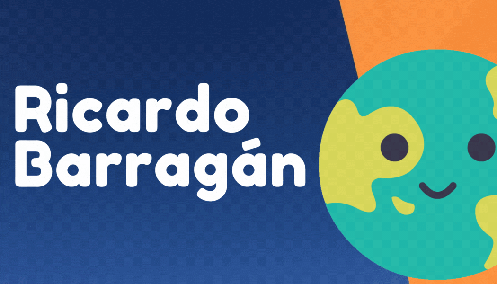

**Hello there** 👋 

Hi, I’m Ricardo Barragán from *México* 🇲🇽.

Since a couple of years I started to be interested in the power of data. Since then I started to think about the possibilities of data, data visualization and data analysis. 

**Intested in ...**

I’m also interested in sustainable projects, languages and technology. Therefore, in this GitHub you will find some repositories and projects that have as a core the sustainability, languages, technology or probably other topics that I find interesting. 

**Learning ...**

I’m currently learning and mastering R and Python with different projects. I am developing some projects where I analyze data or I am developing some automation projects that help me in my job or life.

**Interested to colaborate in ...**

I’m looking to collaborate on sustainable projects.

**How to reach me?** 

Feel free to contact me via email or LinkedIn.

 

<!---
Ricardo-BarMa/Ricardo-BarMa is a ✨ special ✨ repository because its `README.md` (this file) appears on your GitHub profile.
You can click the Preview link to take a look at your changes.
--->
